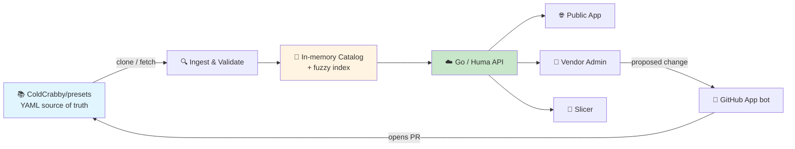
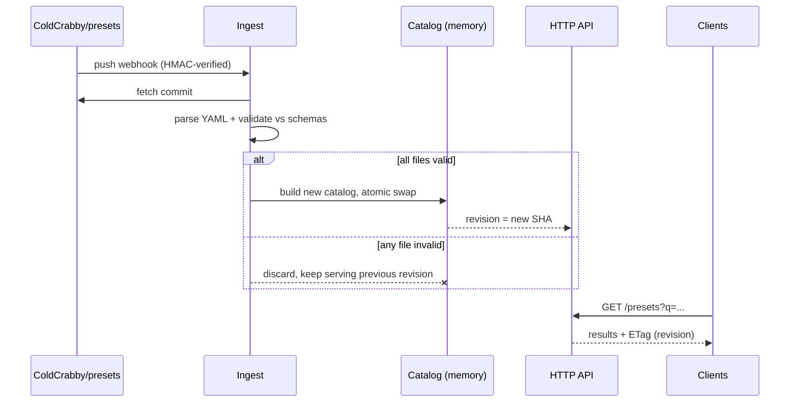

# Architecture Guide

How the Cold Crabby preset cloud is put together: what serves the catalog, where
the data actually lives, and why there is no database.

This document is the system-level view. The preset format itself is specified in
[docs/preset-schema.md](./docs/preset-schema.md), the HTTP contract in
[docs/api-surface.md](./docs/api-surface.md), and the vendor-facing flows in
[docs/vendor-workflow.md](./docs/vendor-workflow.md).

## Table of Contents

1. [High-Level Overview](#high-level-overview)
2. [The Three Repositories](#the-three-repositories)
3. [Monorepo Layout](#monorepo-layout)
4. [Data Flow](#data-flow)
5. [Ingest & Catalog Rebuild](#ingest--catalog-rebuild)
6. [Search](#search)
7. [Identity & Ownership Without a Database](#identity--ownership-without-a-database)
8. [Slicer Integration](#slicer-integration)
9. [Technology Choices](#technology-choices)
10. [Deliberate Exclusions](#deliberate-exclusions)
11. [Known Risks](#known-risks)

---

## High-Level Overview

The preset cloud is a **read-mostly projection of a Git repository**.
`ColdCrabby/presets` holds vendor-maintained preset YAML. This service ingests
that repository, validates every file, holds the result in memory, and serves it
over an OpenAPI-described HTTP API to three consumers: the public browse app, the
vendor admin app, and the slicer itself.

Writes never touch the running catalog. A vendor editing a preset produces a
**pull request** against `ColdCrabby/presets`. Once merged, the change flows back
in through the same ingest path as everything else.



The important property: **every byte the API serves is derivable from a single
Git commit.** Delete the server, start a new one, and it rebuilds itself from
`main`. Nothing is stored that Git does not already have.

---

## The Three Repositories

| Repository | Role |
| --- | --- |
| [`ColdCrabby/presets`](https://github.com/ColdCrabby/presets) | **Source of truth.** Vendor-maintained preset YAML and vendor ownership manifests. Reviewed through ordinary GitHub PRs. |
| [`ColdCrabby/cloud-presets`](https://github.com/ColdCrabby/cloud-presets) | **This repo.** The Go API plus the two Angular frontends. Holds no preset data of its own. |
| [`ColdCrabby/slicer`](https://github.com/ColdCrabby/slicer) | **Consumer, and owner of the schema.** Publishes the JSON Schemas that define what a valid preset is. |

### The slicer owns the schema

This is the load-bearing decision of the whole design.

The slicer generates JSON Schemas from its own Rust profile types into
`ui/src/schemas/slicer-engine-{printer,filament,process}-profile-v1.json`. Those
schemas are exhaustive — the shared `SlicingParams` definition alone carries 92
typed properties.

The cloud **vendors those schema files** and validates against them at ingest.
It does not maintain a parallel description of what a preset looks like.

The consequence is that the catalog physically cannot drift from what the slicer
is able to consume. A preset that would fail to load in the slicer fails
validation in CI, before it is ever merged. The alternative — a hand-written
cloud-side schema kept "in sync" by discipline — would decay on the first
upstream field addition.

---

## Monorepo Layout

The Go API and both frontends live together so that a single OpenAPI document
generates the client both apps consume, and a schema change is one atomic commit
rather than a cross-repo dance.

```
cloud-presets/
├── cmd/                  # entrypoints (API server, OpenAPI export, preset validator CLI)
├── internal/
│   ├── catalog/          # in-memory catalog + atomic swap
│   ├── ingest/           # git fetch, parse, validate (not yet implemented)
│   ├── search/           # fuzzy index (not yet implemented)
│   ├── api/              # Huma operations, DTOs
│   ├── auth/             # Stytch JWT verification (ownership authorization not yet implemented)
│   └── github/           # GitHub App client, PR creation (not yet implemented)
├── schemas/              # vendored from ColdCrabby/slicer
├── openapi.yaml          # OpenAPI 3.1 doc exported from the Go API
├── apps/
│   ├── public/           # Angular: browse & search
│   └── vendor-admin/     # Angular: authenticated vendor management
├── packages/
│   ├── ui/               # shared Angular UI primitives
│   └── api-client/       # OpenAPI client generated for both apps
├── openapi/              # spec the frontend client is currently generated from (see docs/frontends.md)
├── tools/stub-api/       # dependency-free stand-in for the Go API, for frontend dev
└── docs/
```

See [docs/frontends.md](./docs/frontends.md) for why the frontend client is
generated from `openapi/` rather than the root `openapi.yaml` for now.

`schemas/` is a **vendored copy, not a submodule** — pinned, reviewable, and
updated by an explicit PR so a schema bump is a visible, deliberate act.

The validator CLI in `cmd/` is published as a release artifact and is what the
presets repository's CI runs. That repository keeps **no schema copy of its
own**. CI and ingest agree because both run the *same pinned artifact digest* —
the presets repo pins the validator it trusts, and ingest is required to use that
digest. Pinning is what makes the guarantee real; "both are recent builds" would
not be. See
[docs/presets-repo-layout.md](./docs/presets-repo-layout.md#one-validator-not-two-copies).

---

## Data Flow



A failed ingest is a **no-op**, never a partial update. The previously good
catalog keeps serving. A bad merge degrades freshness, not availability.

---

## Ingest & Catalog Rebuild

**Triggers**, in order of authority:

1. **Startup** — fetch and build before the server reports ready.
2. **Push webhook** — GitHub notifies on merge to `main`; the payload signature
   is HMAC-verified before anything else happens.
3. **Periodic poll** — a fallback that compares the remote `main` SHA against the
   served revision. Webhooks get missed (downtime, misconfiguration); without a
   poll the catalog would silently sit stale forever.
4. **Manual trigger** — an authenticated operator endpoint, for recovery.

**Every trigger is only a hint.** No trigger carries the revision to build. A
webhook proves origin, not freshness — deliveries can arrive late, out of order,
or be replayed. So each trigger causes the same action: resolve the current
`main`, and build that.

**Builds are serialized and coalesced.** One build runs at a time; triggers
arriving during a build collapse into a single follow-up run. Without this,
concurrent builds could finish out of order and an older catalog could overwrite
a newer one — a silent rollback that no commit describes.

The swap is a **compare-and-swap on the head SHA**: the built catalog is
published only if the commit it was built from is still the head the server
intends to serve. A late or replayed trigger can therefore never move the catalog
backwards.

**Build steps:** fetch → walk preset files → parse YAML → validate each against
the vendored schema for its type → check cross-file invariants (unique IDs,
vendor namespace matches the owning manifest) → build the fuzzy index → swap.

The swap replaces a pointer to an immutable catalog value. Readers hold the old
one until their request finishes; no locking on the read path, no half-built
state visible. In-flight requests keep the previous generation alive briefly, so
peak memory spans two catalogs — bounded by the size limits below.

**Validation is strict.** Unknown fields and out-of-range values are rejected
rather than silently dropped, because a typo that gets quietly ignored surfaces
much later as a preset that behaves subtly wrong on someone's printer.

### Cold start and multiple instances

Readiness is false until the first successful ingest, because an instance with an
empty catalog would serve confident, empty results. The consequence is explicit:
**a GitHub outage during a full restart is a full outage.** That is accepted for
now — the alternative, booting from a cached artifact, adds a second source of
truth to a design whose main asset is having one.

Instances ingest independently, so during a rollout **different instances may
briefly serve different revisions**. This is tolerated: every revision served is
a real, valid commit, and clients see the revision they got via
`X-Catalog-Revision`. It does mean a client can observe a revision going
backwards across requests if it is load-balanced between instances mid-rollout,
which is why the revision is advisory metadata rather than something clients are
asked to order.

### Size and rate limits

The design assumes a small catalog, so the assumption is enforced rather than
hoped for: bounded per-file size and YAML parser limits (depth, aliases, total
nodes), a bounded total preset count, bounded query length and page size,
request timeouts, and rate limits on public reads and vendor writes. A catalog
that outgrows these limits should fail loudly at ingest, not degrade quietly into
multi-second responses and memory pressure.

---

## Search

Fuzzy search is a **core API responsibility**, not a client-side convenience.
The slicer's current catalog picker filters with plain substring matching in the
browser, which requires shipping the entire catalog to every client and gives no
ranking. Server-side search keeps payloads small and puts ranking in one place
where all three consumers benefit.

The index is built in memory alongside the catalog, over the short text fields
that matter: name, vendor, model, material. Matching uses a Sublime-style
subsequence algorithm that returns **both a score and matched character
positions**, so the frontends can highlight *why* a result matched.

For a catalog of this size — thousands of small records — this is a scan over
in-memory strings. It needs no external search engine, no separate process to
operate, and no index to keep coherent with the catalog: the index *is* rebuilt
with the catalog, atomically, from the same commit.

---

## Identity & Ownership Without a Database

There is no user table because there is no database. Two external systems hold
what would otherwise be persisted state:

- **Stytch B2B holds identity.** A vendor company is a Stytch **Organization**;
  vendor staff are **Members**. Sign-in is GitHub or Google.
- **Git holds ownership.** `ColdCrabby/presets` carries a per-vendor manifest
  binding a vendor namespace to its Stytch organization ID.

Authorization is the intersection: the API validates the caller's session JWT
offline against Stytch's JWKS, reads the organization claim, and compares it to
the manifest for the namespace being written. Because the manifest is a file in
Git, **granting a vendor ownership is itself a reviewed pull request** with full
history — which is a stronger audit trail than a mutable database row.

Validation is local. Claims are read from the signed JWT, so authorizing a
request costs no network round-trip to Stytch.

**Writes authorize against `main`, not against the served catalog.** The served
catalog can lag — that is the whole point of keeping the last good revision when
ingest fails — and authorizing against a lagging snapshot would honour ownership
that Git has already revoked. Write requests therefore resolve the current head,
authorize against the manifest at that exact commit, and fail closed if the head
cannot be resolved. Reads continue to serve the last good catalog.

Two limits are inherent rather than incidental. Revoking ownership takes effect
when the change is merged, and because JWTs are validated offline, **a session
already issued stays valid until it expires** — so revocation is bounded by the
token lifetime, not instantaneous. Both are covered in
[docs/vendor-workflow.md](./docs/vendor-workflow.md).

### Secrets

The system holds a GitHub App private key, a webhook HMAC secret, Stytch
project credentials, an email provider token, operator credentials, and a
signing key for slicer hand-off tokens. These live in managed secret storage,
never in the repository or the container image.

Rotation is designed for rather than deferred: verification accepts the previous
secret during an overlap window so a rotation does not require a synchronized
restart. The GitHub App is granted the narrowest useful permissions — enough to
push branches and open pull requests, and deliberately **not** enough to bypass
branch protection on `main`. The bot proposes; humans merge.

---

## Slicer Integration

The slicer already has the seam. `ui/src/app/services/catalog/cloud-catalog.ts`
defines a `CatalogSource` interface behind a `CATALOG_SOURCE` injection token,
currently bound to an `UnavailableCatalogSource` that rejects every call. Pointing
the slicer at this API is a provider override, not a refactor.

That existing interface is **fetch-all** — `printers()`, `filaments()`,
`profiles()`, each returning a complete array. The public browse app needs
paginated server-side search. These are different shapes, and the API serves
**both**:

- **Bulk category endpoints** satisfy the slicer's current contract with no
  changes on the slicer side.
- **Search endpoints** serve the public app, and give the slicer a migration
  target when its catalog picker outgrows loading everything.

Supporting both is deliberate. Forcing the slicer to adopt pagination as a
precondition would couple this project's launch to a release of a separate
application.

For "Sync with Cloud", the slicer does **not** open pull requests. It obtains
user context and hands off to Vendor Admin, where the vendor reviews the diff and
creates the PR. This keeps PR authorship in one place, behind one review step,
rather than spread across every installed slicer.

---

## Technology Choices

| Concern | Choice | Why |
| --- | --- | --- |
| API framework | **Huma v2** (Go) | OpenAPI 3.1 generated from Go types, so the spec cannot drift from the handlers. Runs on the stdlib `http.ServeMux` adapter — no router dependency. |
| Preset format | **Flat YAML** | Human-diffable in PRs, which is the entire review model. |
| Catalog | **In-memory, immutable** | The dataset is small and read-mostly; rebuildable from Git, so persistence buys nothing. |
| Search | **In-process fuzzy matcher** | Returns scores and match positions; no service to operate. |
| Auth | **Stytch B2B** | Organization/Member model maps to vendor companies; offline JWT validation; enterprise SSO available later without re-architecting. |
| PR automation | **GitHub App (bot)** | Installation tokens scale with the org and need no per-vendor GitHub authorization. |
| Frontends | **Angular 22** | Matches the slicer UI: standalone components, signals, `OnPush`, SCSS, Vitest, pnpm. |

---

## Deliberate Exclusions

These were considered and rejected. Each is a real capability someone will ask
for; the reasoning is recorded so the discussion does not restart from zero.

**PostgreSQL / any database.** The authoritative dataset is a Git repository, and
every served structure is derived from one commit. A database would introduce a
second source of truth that can disagree with Git, plus migrations, backups, and
connection management — in exchange for nothing the in-memory catalog does not
already provide at this scale.

**External search engine.** Elasticsearch, Meilisearch, or similar would add an
operational dependency and a coherence problem (index vs. catalog) to solve a
problem that a few thousand short records do not have.

**Cloud favorites.** Per-user state implies user records, which implies the
database that was just excluded. The slicer already has a local, offline-capable
profile library; favorites belong there.

**Community ratings.** Ratings on printer presets are a safety-adjacent
signal — a highly-rated preset is not a *correct* preset for someone else's
machine — and a rating system invites gaming and moderation load that this
project has no capacity to absorb.

**Custom discussion / feedback system.** GitHub already provides issues,
discussions, and PR review threads on the exact files under discussion.
Rebuilding that would fragment the conversation away from the change itself.

**Custom Git-based moderation workflow.** Vendors own their namespaces and GitHub
provides CODEOWNERS, branch protection, and required reviews. A bespoke
moderation layer would reimplement mechanisms GitHub already enforces.

---

## Known Risks

**Schema versioning is the main long-term risk.** The catalog is pinned to
`*-profile-v1`. Older slicer builds must keep working when a `v2` arrives, so the
versioning policy — how both are served during a transition — has to be settled
before `v2` is needed, not during. See
[docs/preset-schema.md](./docs/preset-schema.md).

**Ingest is a single point of staleness.** If validation starts rejecting a
merged commit, the catalog silently keeps serving an older revision. The served
revision is therefore exposed through the API so staleness is observable rather
than invisible.

**Bot-authored PRs lose per-vendor attribution on GitHub.** All commits come from
one app identity, so `git blame` on a preset shows the bot, not the person.
Provenance lives in the pull request body and a commit trailer instead. Anyone
auditing "who changed this temperature" must read the trailer or the linked PR —
`git blame` alone will mislead them.

**The catalog's scale assumption is enforced, not assumed.** See
[Size and rate limits](#size-and-rate-limits). If the catalog outgrows in-memory
serving, the bulk endpoints are the first thing to break, and they are also the
hardest to withdraw because old slicer builds depend on them.
