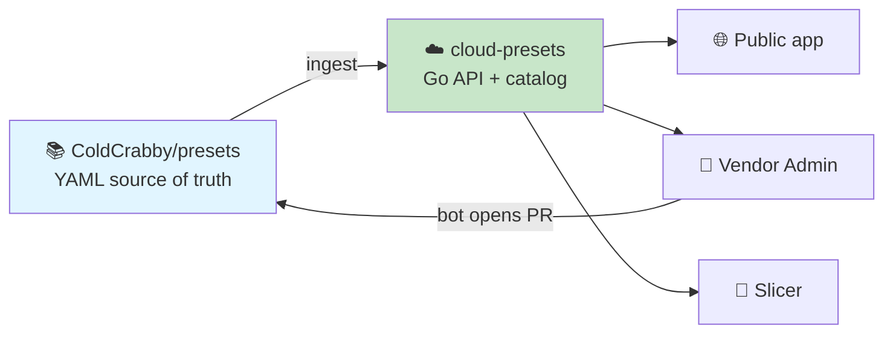

<div align="center">

# Cold Crabby — Preset Cloud

**A cloud preset registry that keeps printer profiles centralized, searchable, and always up to date.**

</div>

---

Vendors publish printer, filament, and process presets as YAML in
[`ColdCrabby/presets`](https://github.com/ColdCrabby/presets). This service
ingests that repository, validates every file, and serves it as a searchable
catalog to the [Cold Crabby slicer](https://github.com/ColdCrabby/slicer), a
public browse app, and an authenticated vendor admin app.

There is **no database**. Git is the source of truth, the catalog is held in
memory, and everything the API serves is derivable from a single commit. Delete
the server and a new one rebuilds itself from `main`.

> **Status: foundation.** The Go module and the Huma v2 API skeleton are in
> place: a health endpoint, the in-memory catalog store, and build-time OpenAPI
> export. Ingest, search, auth, and the frontends land in later waves. See
> [Development](#development).

---

## How the pieces fit



| Repository | Role |
| --- | --- |
| [`presets`](https://github.com/ColdCrabby/presets) | Vendor-maintained preset YAML. Reviewed through ordinary GitHub pull requests. |
| **`cloud-presets`** (this repo) | The Go API and both Angular frontends. Holds no preset data of its own. |
| [`slicer`](https://github.com/ColdCrabby/slicer) | Consumes the catalog — and **owns the schema** that defines a valid preset. |

The slicer generates JSON Schemas from its own profile types. This project
vendors those schemas and validates against them, so the catalog cannot drift
from what the slicer is actually able to load.

---

## Documentation

Start here:

- **[ARCHITECTURE.md](./ARCHITECTURE.md)** — system design, data flow, the
  no-database rationale, and the capabilities deliberately left out.

Then, by topic:

| Document | Covers |
| --- | --- |
| [docs/preset-schema.md](./docs/preset-schema.md) | The canonical flat YAML format, required fields per type, the `params` bag, validation rules, and schema versioning. |
| [docs/presets-repo-layout.md](./docs/presets-repo-layout.md) | How `ColdCrabby/presets` is organised, and how vendor ownership is expressed as files instead of database rows. |
| [docs/api-surface.md](./docs/api-surface.md) | Endpoints, caching by catalog revision, the error model, and OpenAPI client generation. |
| [docs/vendor-workflow.md](./docs/vendor-workflow.md) | Vendor sign-in, authorization, and how an edit becomes a merged pull request. |

---

## Design in brief

**Presets are flat.** No `inherits:`, no base presets, no resolution step. The
review model is reading a diff on GitHub, and inheritance would mean a one-line
change silently altering presets the diff never shows.

**Search runs on the server.** Fuzzy matching over the in-memory catalog returns
ranked results with matched character positions for highlighting — no external
search engine, and no shipping the whole catalog to every client just to filter
it.

**Writes become pull requests.** A vendor edit is validated, committed by a
GitHub App bot, and opened as a PR against `ColdCrabby/presets`. Vendors keep
ownership of their presets; the community contributes through the same PRs.
Nothing reaches the catalog without landing in Git first.

**Authorization needs no user table.** Identity comes from
[Stytch B2B](https://stytch.com) (vendor company = Organization, staff = Members,
sign-in with GitHub or Google) and is validated offline from a signed JWT.
Authority comes from a `vendor.yaml` manifest in Git. Granting a vendor ownership
is therefore itself a reviewed pull request.

---

## Planned stack

| Layer | Choice |
| --- | --- |
| API | Go with [Huma v2](https://github.com/danielgtaylor/huma) — OpenAPI 3.1 generated from the handler types |
| Catalog | In-memory, immutable, rebuilt atomically per Git commit |
| Search | In-process fuzzy matching with scores and match positions |
| Auth | Stytch B2B — offline JWT validation via JWKS |
| Git automation | GitHub App via `go-github` + `ghinstallation` |
| Frontends | Angular 22 — standalone components, signals, `OnPush`, SCSS, Vitest, pnpm |

The frontends follow the slicer UI's existing conventions rather than
introducing a second house style.

---

## Development

The API is a Go 1.25+ module using [Huma v2](https://github.com/danielgtaylor/huma)
on the stdlib `http.ServeMux` (via the `humago` adapter). Package layout follows
[ARCHITECTURE.md](./ARCHITECTURE.md#monorepo-layout): entrypoints live in
[`cmd/`](./cmd), implementation in [`internal/`](./internal).

```bash
make build      # compile everything
make test       # run the test suite
make run        # start the server (ADDR defaults to :8080)
make openapi    # write the OpenAPI 3.1 document (OPENAPI_OUT defaults to openapi.yaml)
```

`GET /v1/health` reports liveness plus readiness and the served catalog
revision. Readiness is `false` and `revision` is `null` until the first ingest
loads a catalog:

```bash
curl -s localhost:8080/v1/health
# {"status":"ok","ready":false,"revision":null,"lastIngest":null}
```

Errors render as RFC 9457 `application/problem+json`. The build-time OpenAPI
document ([openapi.yaml](./openapi.yaml)) is what the Angular client generator
consumes — regenerate it with `make openapi` whenever request or response types
change.

---

## License

See [`ColdCrabby/slicer`](https://github.com/ColdCrabby/slicer) for project-wide
licensing.
