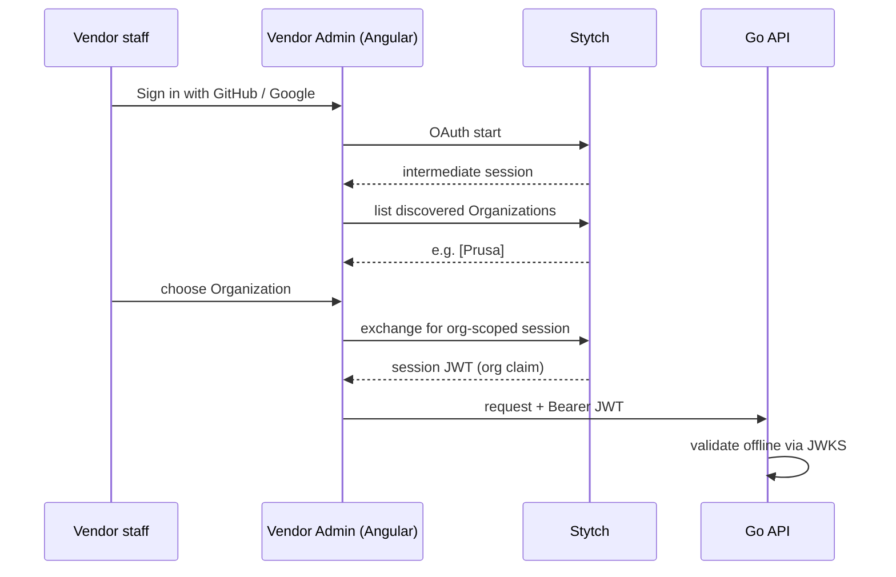
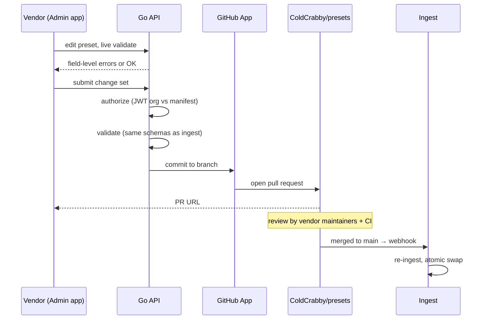

# Vendor Workflow

How vendors sign in, what they are allowed to change, and how an edit in the
admin app becomes a merged preset.

The HTTP endpoints are listed in [api-surface.md](./api-surface.md); the
ownership manifest is described in
[presets-repo-layout.md](./presets-repo-layout.md).

## Table of Contents

1. [Identity Model](#identity-model)
2. [Sign-In](#sign-in)
3. [Token Validation](#token-validation)
4. [Authorization](#authorization)
5. [Change to Pull Request](#change-to-pull-request)
6. [Community Contributions](#community-contributions)
7. [Slicer Hand-Off](#slicer-hand-off)
8. [Email](#email)
9. [Enterprise SSO Later](#enterprise-sso-later)

---

## Identity Model

Authentication is **Stytch B2B**. The mapping is direct:

| Concept | Stytch | Meaning here |
| --- | --- | --- |
| Vendor company | **Organization** | Prusa, Bambu, a filament manufacturer |
| Vendor staff | **Member** | A person who may edit that vendor's presets |
| Role | **Member role** | Distinguishes who may propose vs. who may administer |

Stytch was chosen over a plain OIDC provider because this is a **multi-tenant B2B
problem, not a consumer login problem**. Vendors are organizations with several
staff, and the organization model is built in rather than something to construct
on top of a flat user list — which, without a database, there would be nowhere to
put.

Stytch holds all user records. This project operates no user store, which is what
keeps the no-database property intact. The one qualification is that merged
commits permanently publish provenance — see
[Change to Pull Request](#change-to-pull-request).

---

## Sign-In

Vendor staff sign in with **GitHub or Google**. There are no passwords: adding a
password database to a system with no database would be self-defeating, and
vendor staff already have one of these identities.

The flow uses Stytch's **Discovery** model, which fits multi-tenancy well:

Discovery matters because a person may legitimately belong to more than one
vendor. The session is scoped to **one organization at a time**, so "which
vendor am I acting as?" is answered by the token rather than by a dropdown the
client could get wrong.

The frontend uses **`@stytch/vanilla-js`**. There is no official Angular SDK —
Stytch ships React bindings only — so the admin app wraps the vanilla client in
an Angular service exposing signals, consistent with the slicer UI's conventions.
Stytch also ships **prebuilt UI components, including an Admin Portal** for
organization settings and member management, which removes most of the
"invite a colleague, manage members" surface from this project's scope.

One thing this is **not**: standard OIDC. Stytch's first-party login is its own
session model, so generic libraries like `angular-auth-oidc-client` do not apply
here. (Stytch *can* act as a standards-compliant OAuth server for third-party
clients — see [Slicer Hand-Off](#slicer-hand-off).)

---

## Token Validation

The API validates session JWTs **offline**, against Stytch's cached JWKS. No
network call to Stytch on the request path, so authorization costs microseconds
and the API stays available for reads even if Stytch is briefly unreachable.

Validation checks the signature, `iss`, `aud`, `exp`/`iat`, and a maximum token
age. Signing keys rotate roughly every six months, with both keys published
during a one-month overlap, so cached JWKS refresh is routine rather than a
cutover.

### The five-minute lifetime

**Stytch session JWTs expire after a fixed five minutes**, regardless of how long
the underlying session lasts. This is the single most surprising operational
detail in the auth design, and it has to shape the admin app deliberately:

- The long-lived artifact is the **opaque session token**, not the JWT.
- The frontend refreshes the JWT continuously in the background.
- A vendor composing a large change set will cross several JWT expiries before
  submitting. If the app only refreshed on navigation, submission would fail
  after a long edit — precisely when the most work is at risk.

So the admin app treats a `401` as "refresh and retry once", and only surfaces a
sign-in prompt when the refresh itself fails.

---

## Authorization

Two independent facts decide every write:

1. **Who is calling** — the `organization_id` claim inside the validated JWT.
2. **Who owns the target** — `stytch_organization_id` in the `vendor.yaml` of the
   directory being written, read **at the current `main`**, not from the served
   catalog.

A write is permitted only when they match. Roles from the JWT's `roles` claim
then distinguish proposing a change from administering the organization.

The distinction in point 2 matters. The served catalog deliberately lags when
ingest fails, so authorizing against it would honour ownership that Git has
already revoked. Writes therefore resolve the head, authorize against the
manifest at that exact commit, and **fail closed** if the head cannot be
resolved. Reads keep serving the last good catalog.

This is the mechanism that replaces a permissions table. Identity comes from a
signed token; authority comes from a reviewed file in Git. Neither requires a
database, and the authority half gains full history, attribution, and code
review as a side effect.

Consequences worth stating:

- A vendor **cannot** write outside its own directory. The scope comes from the
  token, never from a client-supplied parameter.
- The shared `processes/` namespace has no organization mapped to it, so **no
  vendor can write there through the API** at all.
- Revoking ownership is a pull request changing the manifest.

### Revocation is not instant

Two delays compound, and both are inherent to the design rather than oversights:

- **The manifest change must be merged.** Until then, Git still says the vendor
  owns the directory.
- **Already-issued JWTs stay valid until they expire.** Offline validation is
  what makes authorization free on the request path, and the direct cost is that
  the API cannot know a session was revoked mid-flight. The window is bounded by
  the five-minute JWT lifetime.

So the honest statement is: revocation takes effect within roughly the token
lifetime *after* the manifest change merges. Suspending the organization in
Stytch stops **new** JWTs from being issued immediately, which is the fastest
available lever, but it does not invalidate a JWT already in a browser tab. Any
claim of instant cutoff would be false unless the API introspected every write
against Stytch online — which is a deliberate trade this design declines for
reads and could adopt for writes if the window ever proved unacceptable.

---

## Change to Pull Request

**The pull request is the record.** No change queue is persisted server-side;
status is read back from the GitHub API on demand. There is nothing to reconcile
between a local queue and GitHub's state, because there is no local queue.

**Submission is idempotent, because it has to be.** Creating a branch, committing,
and opening a PR are separate GitHub calls that cannot be made atomic. A timeout
between them leaves either an orphaned branch or a pull request the client never
heard about, and a plain retry would open a duplicate. Each submission carries an
idempotency key derived from its content, mapping to a deterministic branch name,
so a retry re-drives the same branch: reuse what exists, finish what is missing,
return the existing PR. Because recovery reads from GitHub rather than memory, it
survives a restart. Multi-file change sets use the Git Data API (blobs → tree →
commit → ref) so a change set lands as **one commit**, never a series of
individually-invalid states.

**PRs are authored by a bot**, not by the vendor's GitHub account. Vendor staff
authenticate with Stytch and may not have a GitHub account at all — a filament
company's materials engineer should not need one to fix a temperature. A GitHub
App also uses installation tokens, which scale with the organization and need no
per-user authorization dance.

The cost is attribution. Every commit appears to come from the same identity, so
`git blame` names the bot and nothing else. Provenance is recorded explicitly
instead: the PR body and a commit trailer carry the vendor slug, the Stytch
organization ID, and a **stable member identifier** — not an email address. That
is a deliberate privacy choice: the trailer is permanent, public, and
unredactable once merged, so it records the least identifying thing that still
supports an audit. Anyone auditing a change must read the trailer or the PR;
the author field will mislead them.

Note the nuance this creates against "the project stores no user records": the
project operates no user store, but merged commits do permanently publish an
organization ID and a member identifier. Those are provenance records in Git, not
a queryable user database — but they are not erasable either, and vendors should
understand that before their first submission.

Review is ordinary GitHub review: the vendor's own maintainers via CODEOWNERS,
plus required CI. The cloud does not approve or merge anything, and the App's
permissions do not allow it to.

---

## Community Contributions

Anyone may open a pull request against `ColdCrabby/presets` directly. Community
contributions and vendor-submitted changes converge on the same path, get the
same CI validation, and are reviewed by the same owners.

There is no separate submission portal, no moderation queue, and no custom
review tooling — GitHub already provides review threads, suggested changes, and
permissions on the exact files under discussion. The Vendor Admin app is a
**convenience for vendors who do not want to write YAML**, not a privileged
channel into the catalog.

---

## Slicer Hand-Off

"Sync with Cloud" in the slicer does **not** create pull requests. The slicer
identifies the user, hands the change over, and redirects into Vendor Admin,
where the vendor reviews the diff and creates the PR.

Keeping PR authorship in one place means one validation path, one attribution
format, and one review step — instead of every installed slicer being a potential
writer to the catalog.

For identifying the user, the slicer is a **public OAuth client** (a desktop or
browser app that cannot hold a secret). Stytch's **Connected Apps** turns Stytch
into an OAuth 2.1 / OIDC authorization server supporting **Authorization Code
with PKCE** for exactly this case, so the slicer uses standards-based OAuth even
though the admin app uses Stytch's first-party session model.

These are two different credentials, and the API treats them as such. A
Connected Apps access token is **not** a first-party session JWT and is not
accepted on the vendor endpoints. `POST /v1/sync/handoff` has its own contract:
it accepts the slicer's token, and returns a hand-off token plus an admin URL.

The hand-off token is **self-contained** — signed, encrypted, and short-lived,
carrying the draft state itself rather than a key into server storage. Storing
drafts server-side would mean a database, so the state travels in the token.

Critically, the hand-off token **authorizes nothing**. It only lets Vendor Admin
load the draft for review. Creating the pull request requires a normal
authenticated admin session and a fresh ownership check against the current
manifest, so replaying a hand-off token achieves nothing beyond re-opening the
same draft.

This is also why hand-off still succeeds when the user is not signed in to the
admin app, or turns out to own no vendor namespace: the hand-off itself is just a
redirect carrying a draft. Authentication and authorization happen in the admin
app, which can explain what is missing. Failing at the slicer with an opaque
error would leave the user with no path forward.

---

## Email

Email is **notification only**, sent to the contact address in `vendor.yaml`:

- A change set was submitted and a pull request opened
- A pull request was merged and the catalog now serves it
- Ingest rejected a merged commit and the catalog is stale

Nothing in the workflow is driven *by* email, and there is no inbound processing.
Delivery is a hosted transactional provider; no message history is stored, since
GitHub already holds the authoritative record of every change.

The third notification is the important one. Ingest failing after a merge is
invisible from the vendor's perspective — GitHub says merged, the catalog says
otherwise — so it has to be pushed rather than discovered.

---

## Enterprise SSO Later

Some vendors will eventually want staff to sign in through their own corporate
identity provider. The architecture does not need to change for this.

Stytch's B2B free tier includes **five SSO or SCIM connections** and unlimited
organizations, so the first several enterprise vendors cost nothing. An SSO
connection is configured **per organization**: a vendor's members authenticate
through their corporate IdP, and the session JWT that reaches the API carries the
same organization claim as before.

The authorization model is therefore untouched — it reads an organization claim
and compares it to a manifest, and does not care how the member proved who they
were. Adding enterprise SSO is a configuration change in Stytch, not a change to
this API.
